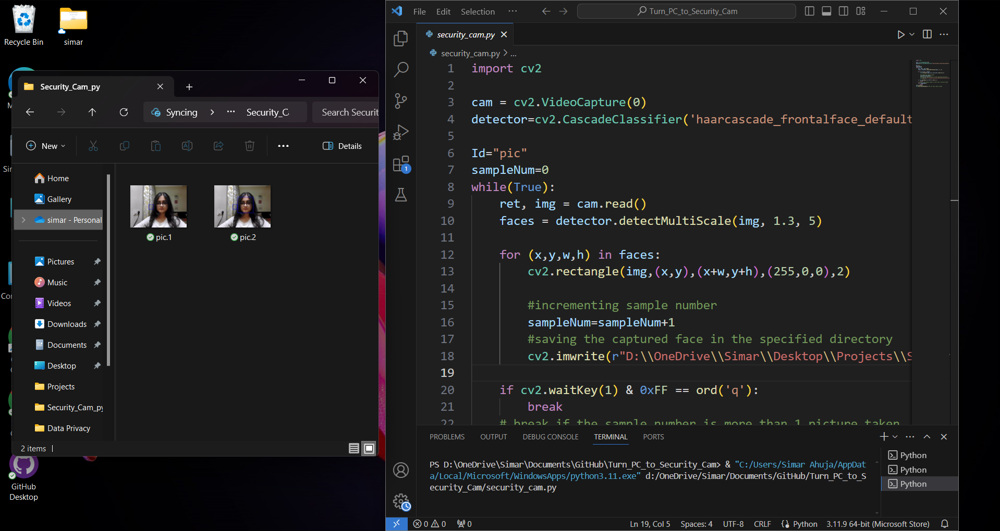

# WatchDog PC
## Turn your PC to Security Cam🕵
Using OpenCV to take a picture when there's a face detected and save it into your laptop's directory, **without showing the cam to the user**
## Demo

#### ✅Required Modules :
  - Opencv   
    ```bash
      pip install opencv-python
    ```
    
#### 🙌Contributions are Welcome
This is just a basic idea on how to take a picture when somebody passes by , it can be improved more by adding the time that this camera should be working according to specific needs.


 
